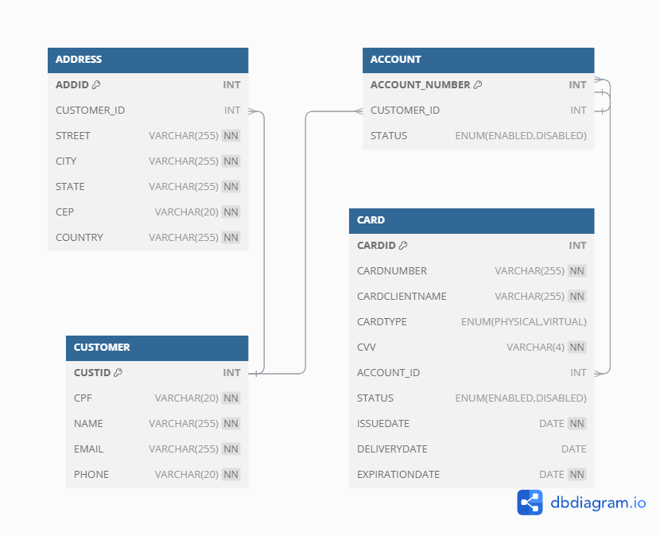

<h1 align="center">
  Desafio Backend Java Pleno alt.bank
</h1>

<p>Desenvolver uma API utilizando Java 17, Maven e, preferencialmente, Quarkus. A API deve entregar as funcionalidades descritas abaixo seguindo boas práticas de desenvolvimento, com camadas de persistência, modelo e serviço. A criação da estrutura de banco de dados é imprescindível (banco de dados relacional, preferencialmente MySQL).</p>

## Tecnologias

- [Spring Boot](https://spring.io/projects/spring-boot)
- [Spring MVC](https://docs.spring.io/spring-framework/reference/web/webmvc.html)
- [Spring Data JPA](https://spring.io/projects/spring-data-jpa)
- [Docker Compose](https://docs.docker.com/compose/)
- [Flyway Migration](https://documentation.red-gate.com/fd/getting-started-with-flyway-184127223.html)
- [MySQL](https://www.mysql.com/)
- [Swagger UI](https://swagger.io/docs/)

## Como Executar

- Clonar repositório git:

```
git clone https://github.com/GiancarloJr/testAB.git
```

- Executar o MySQL:

```
docker-compose up -d
```

- Executar a aplicação Spring Boot
- Acessar aplicação em `http://localhost:8080`.
- Acessar Swagger UI em `http://localhost:8080/swagger-ui/index.html#/`.

## Diagrama de Entidade Relacionamento



